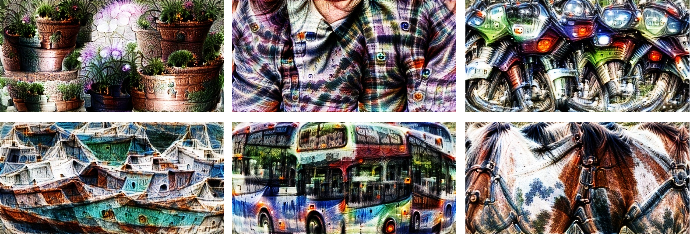

# Torch-Dreams
Making neural networks more interpretable, for research and art. 


[](https://colab.research.google.com/github/Mayukhdeb/torch-dreams-notebooks/blob/main/docs_notebooks/hello_torch_dreams.ipynb)
[](https://github.com/Mayukhdeb/torch-dreams/actions/workflows/main.yml)
[](https://github.com/mayukhdeb/torch-dreams/commits/master)
[](https://app.gitbook.com/@mayukh09/s/torch-dreams/)


[](https://app.gitbook.com/@mayukh09/s/torch-dreams/visualizing-individual-channels)

```
pip install torch-dreams 
```

## Quick start
> Make sure you also check out the [quick start colab notebook](https://colab.research.google.com/github/Mayukhdeb/torch-dreams-notebooks/blob/main/docs_notebooks/hello_torch_dreams.ipynb) and the [docs](https://app.gitbook.com/@mayukh09/s/torch-dreams/) for more interesting examples. 


```python
import matplotlib.pyplot as plt
import torchvision.models as models
from torch_dreams.dreamer import dreamer

model = models.inception_v3(pretrained=True)
dreamy_boi = dreamer(model,  device = 'cuda', quiet =  False)

image_param = dreamy_boi.render(
    layers = [model.Mixed_5b],
)

plt.imshow(image_param.rgb)
plt.show()
```

## Visualize features from multiple models simultaneously

First, let's pick 2 models and specify which layers we'd want to work with

```python
from torch_dreams.model_bunch import ModelBunch

bunch = ModelBunch(
    model_dict = {
        'inception': models.inception_v3(pretrained=True).eval(),
        'resnet':    models.resnet18(pretrained= True).eval()
    }
)

layers_to_use = [
            bunch.model_dict['inception'].Mixed_6a,
            bunch.model_dict['resnet'].layer2[0].conv1
        ]

dreamy_boi = dreamer(model = bunch, quiet= True, device= 'cuda')
```

Then define a `custom_func` which determines which exact activations of the models we have to optimize

```python
def custom_func(layer_outputs):
    loss =   layer_outputs[0].mean()*2.0 + layer_outputs[1][89].mean() 
    return -loss
```

Run the optimization

```python
image_param = dreamy_boi.render(
    layers = layers_to_use,
    custom_func= custom_func,
    iters= 100
)

plt.imshow(image_param.rgb)
plt.show()
```


## Visualize individual channels

```python

layers_to_use = [model.Mixed_6b.branch1x1.conv]

def make_custom_func(layer_number = 0, channel_number= 0): 
    def custom_func(layer_outputs):
        loss = layer_outputs[layer_number][channel_number].mean()
        return -loss
    return custom_func

my_custom_func = make_custom_func(layer_number= 0, channel_number = 119)

image_param = dreamy_boi.render(
    layers = layers_to_use,
    custom_func = my_custom_func,
)
plt.imshow(image_param.rgb)
plt.show()
```

## Using custom transforms:

```python
dreamy_boi = dreamer(model,  device = 'cuda', quiet =  False)

my_transforms = transforms.Compose([
    transforms.RandomAffine(degrees = 10, translate = (0.5,0.5)),
    transforms.RandomHorizontalFlip(p = 0.3)
])

dreamy_boi.set_custom_transforms(transforms = my_transforms)

image_param = dreamy_boi.render(
    layers = [model.Mixed_5b],
)

plt.imshow(image_param.rgb)
plt.show()

```

## You can also use outputs of one `render()` as the input of another

```python
import matplotlib.pyplot as plt
import torchvision.models as models
from torch_dreams.dreamer import dreamer

model = models.inception_v3(pretrained=True)
dreamy_boi = dreamer(model,  device = 'cuda', quiet =  False)

image_param = dreamy_boi.render(
    layers = [model.Mixed_5b],
)

image_param = dreamy_boi.render(
    image_parameter= image_param,
    layers = [model.Mixed_6a],
    iters = 100
)

plt.imshow(image_param.rgb)
plt.show()
```

## Args for `render()`

* `layers` (`iterable`): List of the layers of model(s)'s layers to work on. `[model.layer1, model.layer2...]`
* `image_parameter` (`auto_image_param`): instance of torch_dreams.auto_image_param
* `width` (`int`): width of image to be optimized 
* `height` (`int`): height of image to be optimized 
* `iters` (`int`): number of iterations, higher -> stronger visualization
* `lr` (`float`): learning rate
* `rotate_degrees` (`int`): max rotation in default transforms
* `scale_max` (`float`, optional): Max image size factor. Defaults to 1.1.
* `scale_min` (`float`, optional): Minimum image size factor. Defaults to 0.5.
* `custom_func` (`function`, optional): Can be used to define custom optimiziation conditions to `render()`. Defaults to None.
* `weight_decay` (`float`, optional): Weight decay for default optimizer. Helps prevent high frequency noise. Defaults to 0.
* `grad_clip` (`float`, optional): Maximum value of the norm of gradient. Defaults to 1.

## Args for `dreamer.__init__()`
 * `model` (`nn.Module` or  `torch_dreams.model_bunch.Modelbunch`): Almost any PyTorch model which was trained on imagenet `mean` and `std`, and supports variable sized images (H, W) as inputs. You can also pass multiple models into this argument as a `torch_dreams.model_bunch.Modelbunch` instance.
 * `quiet` (`bool`): Set to `True` if you want to disable any progress bars
 * `device` (`str`): `cuda` or `cpu` depending on your runtime 

## Acknowledgements

* [amFOSS](https://amfoss.in/)
* [Gene Kogan](https://github.com/genekogan) 

